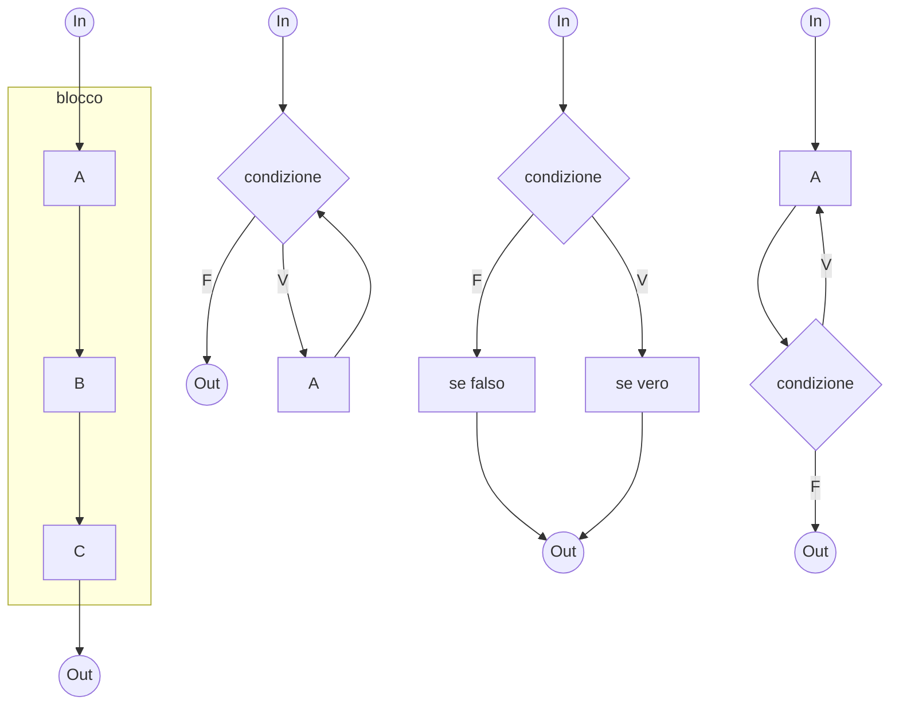

La programmazione si divide in due tipologie:
- ***top-down***: suddivisione di problemi in sotto-problemi sempre più semplici, e gli stessi in sotto-sotto-problemi ancora più semplici per poi concatenare tutti i risultati;
- ***strutturata***: nasce come proposta per regolamentare le metodologie di programmazione, con l'obiettivo di *facilitare la lettura dei programmi*.
## Strutturata
L'idea di fondo è unire le *istruzioni elementari* a dei costrutti detti ***strutture di controllo***: di base sono tre:
- ***concatenazione/composizione sequenziale***: permette di eseguire delle operazioni in ***blocco***;
- ***condizionale***: permette la ***selezione*** in base ad una condizione di parte di codice da eseguire;
- ***ripetizione***: permettono di eseguire un numero di istruzioni per più ***cicli***.

Si impone quindi di avere **un solo ingresso** e **una sola uscita**, la **concatenazione** o **nidificazione** delle strutture l'una dentro l'altra ma **non la sovrapposizione**. Dal ***teorema di Bohm-Jacopini** (1966)*, tali strutture sono ***sufficienti per esprimere ogni algoritmo***.
### Blocco
Permette di **concatenare più istruzioni semplici in un'unica composta** essendo tutte quelle semplici eseguite *sempre* e *sempre nella stessa sequenza*.
### Condizionale
Permette di **scegliere se eseguire o no delle istruzioni** in base ad una ***condizione***. Può presentare istruzioni sia nel ramo *vero* che in quello *falso*.
### Iterazione
Permette di **eseguire più volte la stessa istruzione** fintantoché la condizione scelta si verifichi. Affinché si descriva un algoritmo, il ciclo **deve uscire**, altrimenti mancherebbe la **finitezza**. Vi sono due tipi principali:
- il ***while***, nel quale la condizione viene verificata ***prima*** di eseguire l'istruzione interna;
- il ***do while***, nel quale la condizione viene verificata ***dopo*** aver eseguito una volta l'istruzione.

