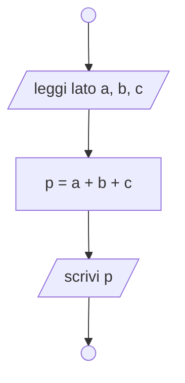
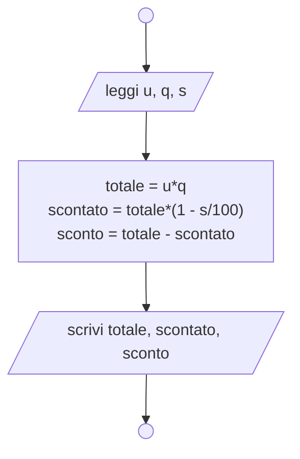
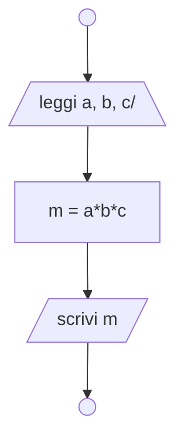
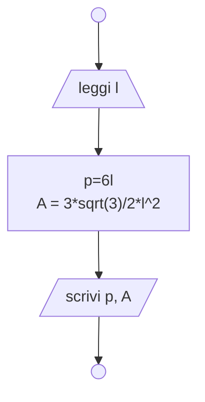
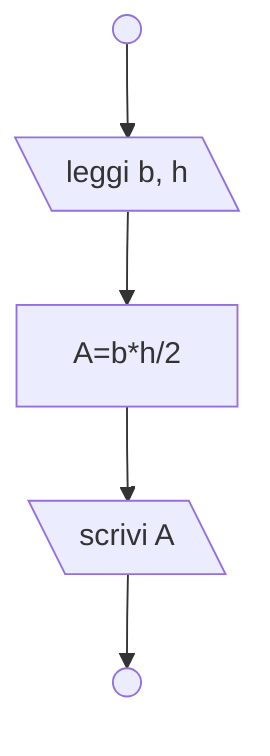
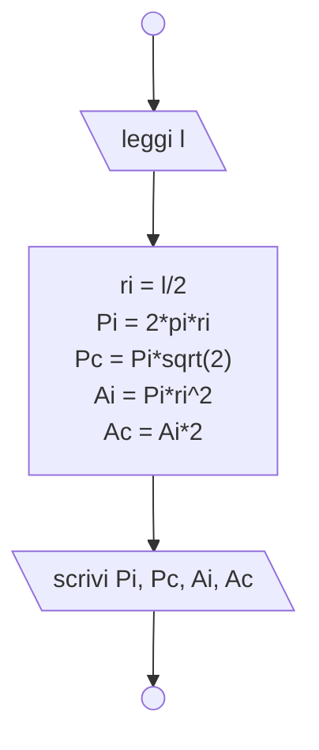

## Strutture sequenziali
> *Lette da input le misure dei lati di un triangolo, calcolarne il perimetro.*

> *Leggere da input prezzo unitario, quantità e percentuale di sconto relativa a una data merce e calcolare l'importo totale, l'importo scontato e lo sconto.*


> *Letti da input i voti di tre materie, calcolare il voto medio.*


> *Acquisito il lato di un esagono regolare, calcolarne perimetro ed area.*


> *Lette la base e l’altezza di un triangolo, calcolarne l’area.*


> *Calcolare il perimetro ed area del cerchio iscritto e di quello circoscritto ad un quadrato di lato noto.*


## Strutture condizionali
> *Inseriti due numeri dall'esterno stamparli in ordine crescente.*
```pseudo
	\begin{algorithm}
	\caption{1}
	\begin{algorithmic}
	\Input a, b
	\If{$a < b$}
		\Print a
		\Print b
	\Else
		\Print b
		\Print a
    \EndIf
    \end{algorithmic}
	\end{algorithm}
```
> *Inserire un numero dall'esterno, dire se diverso da 0, in caso affermativo visualizzare il suo quadrato in caso negativo dire che è uguale a 0.*
```pseudo
	\begin{algorithm}
	\caption{2}
	\begin{algorithmic}
	\Input n
	\If{$n \neq 0$}
		\Print $n^2$
	\Else
		\Print "n è 0"
    \EndIf
    \end{algorithmic}
	\end{algorithm}
```
> *Inseriti due numeri dall'esterno dire se sono uguali tra loro o diversi.*
```pseudo
	\begin{algorithm}
	\caption{3}
	\begin{algorithmic}
		\Input a, b
		\If{$a == b$}
			\Print "Uguali"
		\Else
			\Print "Diversi"
        \EndIf
	\end{algorithmic}
	\end{algorithm}
```
> *Leggere un numero dall'esterno e segnalare se è pari o dispari.*
```pseudo
	\begin{algorithm}
	\caption{4}
	\begin{algorithmic}
	\Input n
	\If{$n % 2 == 0$}
		\Print "n pari"
	\Else
		\Print "n dispari"
    \EndIf	
	\end{algorithmic}
	\end{algorithm}
```
> *Un certo prodotto costa 1 euro al pezzo se si acquistano fino a 10 pezzi, 0,70 euro a pezzo se si acquistano da 11 a 50 pezzi, 0,50 euro se si acquistano più di 50 pezzi. Dare in input il numero di pezzi e visualizzare l’importo da pagare.*
```pseudo
	\begin{algorithm}
	\caption{6}
	\begin{algorithmic}
	\Input n
	\State $p \gets 0$
	\If{$n \leq 10 $}
		\State $p \gets 1$
	\Elif{$n \geq 11$ \And $n \leq 50$}
		\State $p \gets 0.7$
	\Else
		\State $p \gets 0.5$
    \EndIf
    \Print $p\cdot n$
	\end{algorithmic}
	\end{algorithm}
```
> *Una terna pitagorica è un insieme di 3 numeri naturali a<b<c tali che a^2 + b^2 = c^2. Progettare un algoritmo che, a partire dai valori di tre numeri naturali, determini se essi costituiscono o meno una terna pitagorica.*
```pseudo
	\begin{algorithm}
	\caption{7}
	\begin{algorithmic}
	\Input a,b,c
	\If{$a^2+b^2 == c^2$}
		\Print "Sì"
	\Else
		\Print "No"
    \EndIf
    \end{algorithmic}
	\end{algorithm}
```
## Strutture iterative
> *Inserito un numero N intero positivo dall’esterno, calcolare e visualizzare la somma dei primi N numeri naturali.*

```pseudo
	\begin{algorithm}
	\caption{2}
	\begin{algorithmic}
	\Input N
	\State $S\gets 0$
	\State $i \gets 1$
	\While{$i \leq N$}
		\State $S \gets S + i$
		\State $i \gets i+1$
    \EndWhile
    \Print $S$
    \end{algorithmic}
	\end{algorithm}
```
```pseudo
	\begin{algorithm}
	\caption{6}
	\begin{algorithmic}
	\Input N
	\State $i \gets 0$
	\State $pos \gets 0$
	\State $neg \gets 0$
	\While{$i < N$}
		\State Leggi in $m$
		\If{$m > 0$}
			\State $pos \gets pos+1$
		\Elif{$m < 0$}
			\State $neg \gets neg+1$
        \EndIf
		\State $i \gets i+1$
    \EndWhile
    \Print "positivi: $pos$"
    \Print "negativi: $neg$"
    \Print "zeri: $N-neg-pos$"
	\end{algorithmic}
	\end{algorithm}
```
